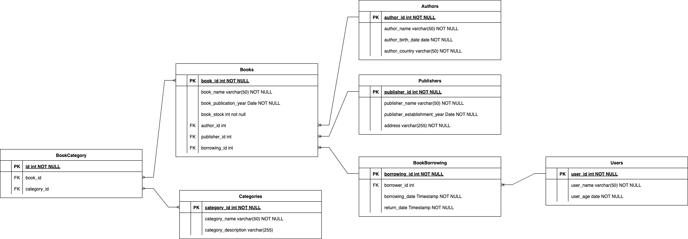
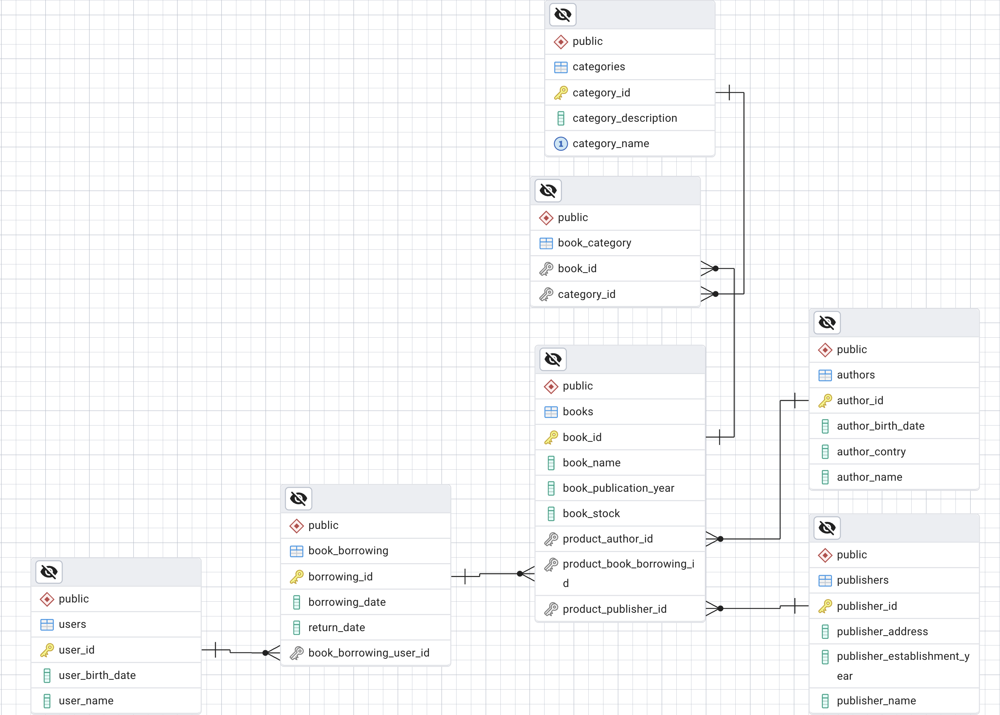

# Pratik - Kütüphane Yönetim Sistemi

Bir kütüphane yönetim sistemi tasarlamanı istiyoruz. Bu kütüphane sisteminde aşağıdaki entity’ler bulunmaktadır.

- Kitap : Kitapların özelliklerini içeren entity/tablo.

- Yazar : Yazarların özelliklerini içeren entity/tablo.

- Kategori : Kitap kategorilerini içeren entity/tablo.

- Yayın Evi : Yayınevlerinin özelliklerini içeren entity/tablo.

- Kitap Ödünç Alınması : Kitap ödünç alma işlemlerini izleyen entity/tablo. Bu tablo, ödünç alınan kitabın kim tarafından alındığını, alınma tarihini ve teslim tarihini içerecektir.

---
### Her bir varlık için temel değişkenler aşağıdaki gibidir.

##### Kitap (Book):

- id (Benzersiz kitap kimliği)

- name(Kitap adı)

- publicationYear (Yayın yılı)

- stock (Kütüphanedeki miktarı)

##### Yazar (Author):

- id (Benzersiz yazar kimliği)

- name (Yazarın adı)

- birthDate (Yazarın doğum yılı)

- country (Yazarın ülkesi)

##### Kategoriler (Category):

- id (Benzersiz kategori kimliği)

- name (Kategori adı)

- description (Kategori tanımı)

##### Yayınevi (Publisher)

- id (Benzersiz kimliği)

- name (Yayınevi ismi)

- establishmentYear (Kuruluş yılı)

- address (Yayınevi adresi)

##### Kitap Ödünç Alma (BookBorrowing)

- id (Benzersiz kimliği)

- borrowerName (Kitap ödünç alan kişi adı soyadı)

- borrowingDate (Kitap ödünç alma tarihi)

- returnDate (Kitabın teslim edildiği tarih, ilk kayıtta null olacak. Kitap teslim edilince tarih güncellenecek)

---
### Bu varlıklar arasında şu ilişkileri tanımlamalısın :

- Bir kitabın bir yazarı olabilir, bir yazarın birden fazla kitabı olabilir. (One-to-Many ilişkisi).

- Bir kategori birden fazla kitaba sahip olabilirken, bir kitap birden fazla kategoriye ait olabilir. (Many-to-Many ilişkisi).

- Bir kitabın bir yayınevi olabilir, bir yayınevinin birden fazla kitabı olabilir. (One-to-Many ilişkisi).

- Bir kitap birden fazla ödünç alma işlemine sahip olabilir, ancak her ödünç alma işlemi yalnızca bir kitaba ait olabilir. (One-to-Many ilişkisi).

# Ödev :

- Maven java projesi açıp dependency’leri tanımlayın.

- Yukarıda belirtilen entity (varlık) sınıflarını ve bunların arasındaki ilişkileri kodunuza yazın.

- Gerekli anotasyonları (@Entity, @Table, @Id, @OneToMany, @ManyToOne, @ManyToMany) yazın.

- Gerekli Fetch ve Cascade anotasyonlarını yazın.

- Entity'lerde temel değişkenler belirtilmiş olup entity'ler arası ilişkilere göre sizler değişken eklemelisiniz.

- Veri tabanı olarak PostgreSQL kullanın.

- Readme dosyasına veri tabanında oluşan her tablonun ekran görüntüsünü ekleyin.

---

# İster UML Analizi

#### Detaylı inceleyebileceğiniz UML için <a href="UML.html"> tıklayınız </a>

---
# DB ERD Şeması

--- 

